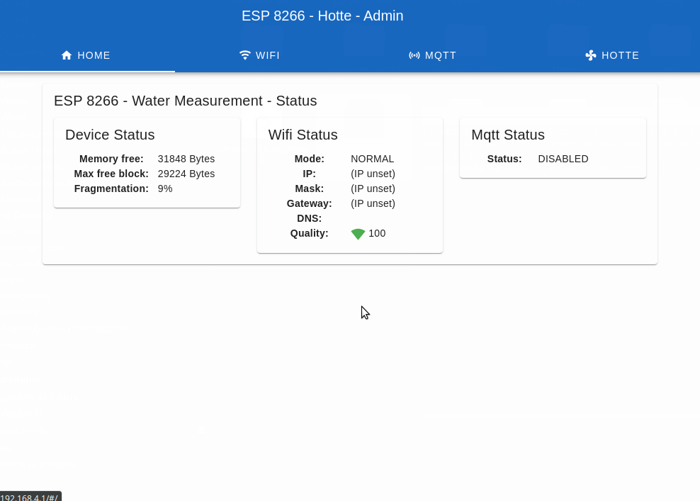

# IR Remote Electrolux Hotte by WiFi

It's a esp8266 Remote IR Electrolux by esp8266 WiFi With API, MQTT (HA discovery) and HTML5 Admin.




## Usage

Use your remote for send a key signal. After open admin for stre your signal with string key.

And for finish send signal by API Or MQTT.

The integrate D4 led is hear for status of device.
 - Up and don't blink. Connected on WiFi
 - Blink. Is mode rescue enabled
 - Blink 4 and stop. SPIFF main error

To activate rescue mode, restart the device 3 times in a row.
To reset usine mode, restart the device 6 times in a row.

## API


### Device

`GET /api/status`

Return status of the device

**Body response**:
```ts
{
    "fragmentation": number,  // Memory fragmentation in %
    "max_free_block": number, // Memory free for create block on device in Bytes
    "memory_free": number     // Memory free on device in Bytes
}
```


### IR

`GET /api/hotte/last`

Return last signal send.

**Body response**:
```ts
[
    {
        "last": string
    },
    ...
]
```


`GET /api/hotte/light/on`
`GET /api/hotte/light/off`
`GET /api/hotte/fan/0`
`GET /api/hotte/fan/1`
`GET /api/hotte/fan/2`
`GET /api/hotte/fan/3`
`GET /api/hotte/fan/4`

Send signal for IR.

**Body response**:
```ts
[
    {
        "result": true
    },
    ...
]
```

### WiFi

`GET /api/wifi/status`

Return current wifi status

**Body response**:
```ts
{

    "ip": string                      // Ip of device or "(IP unset)",
    "mask": string                    // Mask of device",
    "gateway": string                     // Dns of device",
    "dns": string                     // Dns of device",
    "mode": "RESCUE"|"AP"|"STATION",  // Mode of wifi  
    "quality": number                 // Quality of signal WiFi in %
}
```

`GET /api/wifi/scan`

Return lists of signals wifi detected

**Body response**:
```ts
[
    {
        "bssid": string,
        "channel": number,
        "encryption_type": string,
        "is_hidden": boolean,
        "quality": number,
        "ssid": string
    },
    ...
]
```


`GET /api/wifi/config`

Return current configuration

**Body response**:
```ts
{
    "apEnabled": boolean,
    "apPassword": string,
    "apSsid": string,
    "stEnabled": boolean,
    "stSsid": string,
    "stPassword": string,
    "dhcp": "DHCP"|"DHCP_DNS"|"STATIC",
    "dns1": string,
    "dns2": string,
    "gateway": string,
    "ip": string,
    "mask": string,
}
```

`POST /api/wifi/config`

Send new configuration

**Body request**:
```ts
{
    "apEnabled": boolean,
    "apPassword": string,
    "apSsid": string,
    "stEnabled": boolean,
    "stSsid": string,
    "stPassword": string,
    "dhcp": "DHCP"|"DHCP_DNS"|"STATIC",
    "dns1": string,
    "dns2": string,
    "gateway": string,
    "ip": string,
    "mask": string,
}
```

: 

**Body response**:
```ts
{
    "apEnabled": boolean,
    "apPassword": string,
    "apSsid": string,
    "stEnabled": boolean,
    "stSsid": string,
    "stPassword": string,
    "dhcp": "DHCP"|"DHCP_DNS"|"STATIC",
    "dns1": string,
    "dns2": string,
    "gateway": string,
    "ip": string,
    "mask": string,
}
```


### MQTT

`GET /api/mqtt/status`

Return current wifi status

**Body response**:
```ts
{

    "status": string
}
```

`GET /api/mqtt/config`

Return current configuration

**Body response**:
```ts
{
    "enable": boolean,
    "host": string,
    "port": number,
    "login": string,
    "password": string,
    "haDiscovery": string,
}
```

`POST /api/mqtt/config`

Send new configuration

**Body request**:
```ts
{
    "enable": boolean,
    "host": string,
    "port": number,
    "login": string,
    "password": string,
    "haDiscovery": string,
}
```

: 

**Body response**:
```ts
{
    "enable": boolean,
    "host": string,
    "port": number,
    "login": string,
    "password": string,
    "haDiscovery": string,
}
```

## Flash ESP 8266

Import in VSCode PIO project (https://docs.platformio.org/en/latest/integration/ide/vscode.html)

 - 1 - Reset the flash data
 - 2 - Build project
 - 3 - Push in node MCU
 - 4 - Upload static file for web admin


## Diagrams


## Dev front admin

The front is create in VueJs and Vuetify

For build in dev mode:

```
cd vue
npm run serve
```

For recreate spiff final files:

```
cd vue
npm run deploy
```
